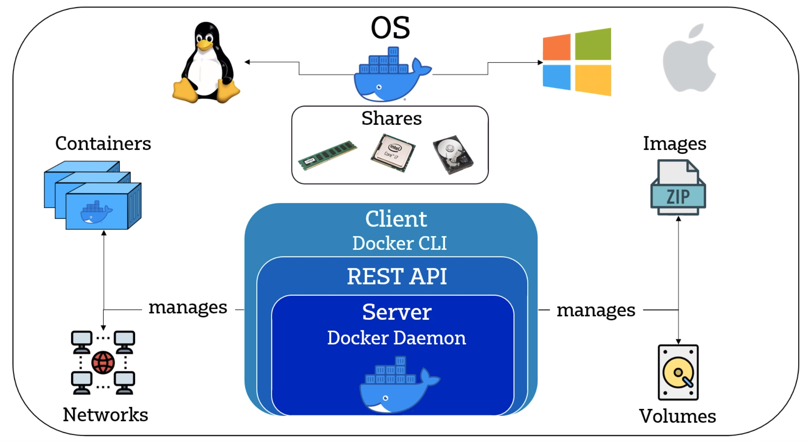

# Containerisation
- separate packages of software - similar to VMs
- conrainers are standardised units for development, shipment and deployment

## Microservice architecture
- each service on different machines
- whole system doesn't rely on one machine like monolith does, so if one machine goes down only one service is impacted
- building/testing of each microservice is all independent - for development and also have freedom of software/technologies for the microservices
- service as a whole doesn't need to be taken down to add more microservices, e.g. adding app/web features can be done without taking down the whole server
- easily scalable but more complicated to deploy than monolith
- used by pretty much everyone (Netflix, uber, spotify etc), and if not it is being planned

# Docker and Dockerhub

- used like github - repos, version history
- can set up webhooks for pushes to repos
- very lightweight 
- competitors: rkt, HyperV etc
- microservices share resources of local host
- VMs vs Docker: fewer layers to get to final product with docker, doesn't install virtual OS
- `docker pull image_name` to download from docker hub, `docker run image_name` will run the contents of the image
- `docker ps` list running containers, and can add `-a` for more info on containers that have already run
- if docker commands aren't working run `alias docker="winpty docker"` to resolve